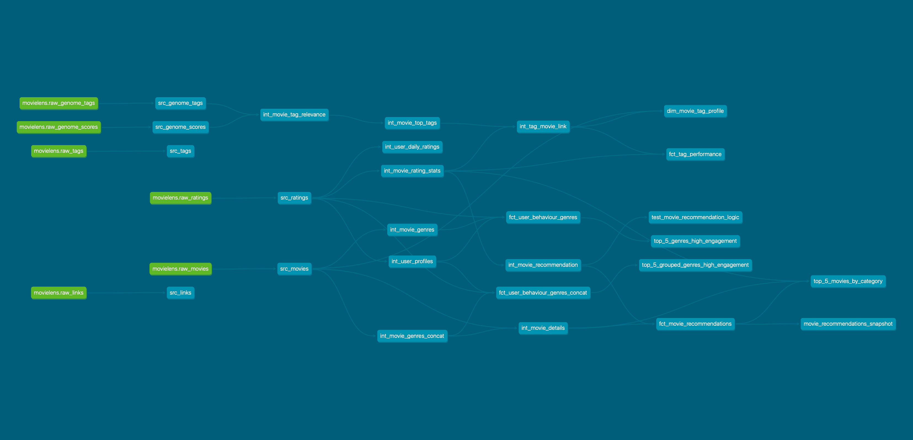

# Netflix Movie Analytics — A Modern Data Stack Project
<br>
September 2025

Roy Wu


## Table of Contents

### Project Overview
1. [Overview](#1-overview)  
2. [Problem Statement / Business Objective](#2-problem-statement--business-objective)  
3. [Key Metrics / Analytics Insights](#3-key-metrics--analytics-insights)  

### Architecture & Modeling
4. [Architecture & Data Flow](#4-architecture--data-flow)  
5. [Data Lineage](#5-data-lineage)  
6. [Project Structure](#6-project-structure)  
7. [Data Modeling Approach](#7-data-modeling-approach)  
8. [Materializations](#8-materializations)  

### Data Quality & Governance
9. [Testing & Quality Checks](#9-testing--quality-checks)  
10. [Version Control](#10-version-control)  

### Insights & Learnings
11. [Challenges and Learnings](#11-challenges-and-learnings)  
12. [Future Improvements](#12-future-improvements)  
13. [Skills Highlight & Summary](#13-skills-highlight--summary)  

### References & Resources
14. [Project Links & Visualizations](#14-project-links--visualizations)  
15. [About the Data](#15-about-the-data)  

<br>

# Project Overview
## 1. Overview
This project demonstrates a complete **analytics engineering pipeline** that transforms raw **MovieLens data** (see [Section 15 – About the Data](#15-about-the-data) for dataset details) from **Amazon S3**, processes it in **Snowflake** using **dbt**, and delivers insights through **Power BI** dashboards. The pipeline is **automated**, **scalable**, and **version-controlled**, ensuring minimal manual intervention, reliable data quality, and full traceability of transformations. 


**Technical Stack**
- **Cloud Storage**: Amazon S3  
- **Data Warehouse**: Snowflake  
- **Transformation**: dbt Core  
- **Business Intelligence**: Power BI  

<br>


## 2. Problem Statement / Business Objective
The goal of this project is to analyze **user ratings**, **tagging activity**, and **movie metadata** to:

- Understand **audience engagement patterns**
- Assess **content performance** by genre and tags
- Generate **recommendations** for movies based on popularity and ratings


<br>


## 3. Key Metrics / Analytics Insights
The three data marts created in this project address different business problems:

- **Audience Analysis** (`fct_user_behaviour_genres`)  
  - **Metrics**: user engagement level, total ratings, average rating per user  
  - **Insights**: Identify highly engaged users and their preferred genres, useful for marketing segmentation and targeted recommendations  

- **Content Analysis** (`dim_movie_tag_profile` & `fct_tag_performance`)  
  - **Metrics**: weighted average rating per tag, number of movies per tag, top tags per movie  
  - **Insights**: Understand which tags or genres correlate with high ratings, useful for content acquisition and promotional strategy  

- **Recommendation** (`fct_movie_recommendations`)  
  - **Metrics**: average movie ratings, rating count, recommendation categories  
  - **Insights**: Recommend top-performing movies to users based on aggregated metrics, useful for personalization engines and improving user satisfaction  


<br>


# Architecture & Modeling
## 4. Architecture & Data Flow  

### Data Pipeline Diagram  

The project follows a **modular, modern data stack architecture**:


### Data Flow  

The data flows through a structured **ELT pipeline**, transforming raw source data into business-ready insights:

1. **Extract & Load**  
   - Raw `.csv` files are stored in **Amazon S3**.  
   - Data is ingested into **Snowflake staging tables** via an **external stage**, keeping storage and compute separate.

2. **Transform**  
   - **dbt** performs all transformations directly in Snowflake.  
   - Raw data is cleaned, joined, and aggregated into **intermediate** and **mart** models.  
   - Transformation logic is managed as **SQL code with version control**, ensuring reproducibility, modularity, and a single source of truth.

3. **Consume & Visualize**  
   - Final dbt models are materialized as business-ready **fact and dimension tables** in Snowflake’s mart layer.  
   - **Power BI dashboards** connect directly to these marts, providing insights into audience engagement, content performance, and movie recommendations.


<br>


## 5. Data Lineage 
The DBT DAG below illustrates the full data flow, from raw source tables to final business-ready marts. This directed acyclic graph makes **dependencies and data lineage explicit**, ensuring transparency and supporting a single source of truth.




<br>


## 6. Project Structure 

The project is structured to follow dbt's best practices, moving from narrow source models to **business-conformed designs**. A disciplined folder layout helps create clear, maintainable stories through both data and codebase.

The key layers are:
- **Staging**: Maps raw source tables with minimal transformations.
- **Intermediate**: Handles joins, aggregations, and reusable logic.
- **Marts**: Business-ready fact and dimension tables for reporting  
- **Domains**: Organized by business area (audience, content, recommendation).  
- **Seeds**: Manages static reference data that isn't part of the core data pipeline (e.g., genre lookup tables). 
- **Macros**: Reusable SQL code snippets used to avoid repetition and enforce consistent logic across models.
- **Tests**: Ensures data quality and integrity. This includes generic checks and specific business logic tests.
- **Snapshots**: Captures historical changes in key source data, providing a full history for time-based analysis.


```
dbt_netflix
├── README.md
├── analyses
│   ├── audience
│   │   ├── audience_analysis.yml
│   │   ├── top_5_genres_high_engagement.sql
│   │   └── top_5_grouped_genres_high_engagement.sql
│   └── recommendation
│       ├── recommendation_analysis.yml
│       └── top_5_movies_by_category.sql
├── seeds
│   └── recommendation_categories.csv
├── dbt_project.yml
├── macros
│   ├── relevance_range.sql
│   ├── top_n_qualify.sql
│   └── weighted_avg.sql
├── models
│   ├── intermediate
│   │   ├── audience
│   │   │   ├── _int_audience__models.yml
│   │   │   ├── int_movie_details.sql
│   │   │   ├── int_movie_genres_concat.sql
│   │   │   ├── int_movie_genres.sql
│   │   │   ├── int_user_daily_rating.sql
│   │   │   └── int_user_profiles.sql
│   │   ├── content
│   │   │   ├── _int_tags__models.yml
│   │   │   ├── int_movie_rating_tag_stats.sql
│   │   │   ├── int_movie_tag_relevance.sql
│   │   │   ├── int_movie_top_tags.sql
│   │   │   └── int_tag_movie_link.sql
│   │   └── recommendation
│   │       ├── _int_recommendation__models.yml
│   │       └── int_movie_recommendation.sql
│   ├── marts
│   │   ├── audience
│   │   │   ├── _audience__models.yml
│   │   │   ├── fct_user_behaviour_genres_concat.sql
│   │   │   └── fct_user_behaviour_genres.sql
│   │   ├── content
│   │   │   ├── _content__models.yml
│   │   │   ├── dim_movie_tag_profile.sql
│   │   │   └── fct_tag_performance.sql
│   │   └── recommendation
│   │       ├── _recommendation__models.yml
│   │       └── fct_movie_recommendations.sql
│   └── staging
│       ├── source.yml
│       ├── src_genome_sources.sql
│       ├── src_genome_tags.sql
│       ├── src_links.sql
│       ├── src_movies.sql
│       ├── src_ratings.sql
│       └── src_tags.sql
├── packages.yml
├── snapshots
│   ├── movie_recommendations_snapshot.yml
│   └── movie_recommendations_snapshot.sql
└── tests
    └── test_movie_recommendation_logic.sql

```


<br>


## 7. Data Modeling Approach
The project follows a **layered, modular modeling strategy** in dbt:  

- **Staging models**: Map raw source tables with minimal transformations.  
- **Intermediate models**: Clean, join, and aggregate data, creating reusable building blocks.  
- **Mart models**: Business-ready fact and dimension tables optimized for analytics.  

The design supports a **star-schema** approach, with fact tables for user behavior, content performance, and recommendations, and dimensions for movies, users, and tags/genres. This approach ensures **clarity, maintainability, and scalable transformations**.


<br>


## 8. Materializations
This project leverages **dbt materializations** strategically for performance, reusability, and maintainability:  

- **Ephemeral models** (`{{ config(materialized='ephemeral') }}`):  
  - Used for **intermediate transformations** that are only referenced by other models and never materialized in the warehouse.  
  - Helps avoid unnecessary tables while keeping logic modular and reusable.  

- **Incremental models** (`{{ config(materialized='incremental') }}`):  
  - Applied to **large tables** like user behavior facts (`fct_user_behaviour_genres`) to optimize load performance.  
  - Only new or changed rows are processed, reducing runtime and resource usage.  

- **Full/mart models** (`table` or `view` materializations):  
  - Fact and dimension tables are persisted in Snowflake for reporting and analytics.  


<br>


# Data Quality & Governance

## 9. Testing & Quality Checks
To ensure **data integrity and reliability**, the project implements the following dbt tests and validations:  

- **Unique key tests**: Verify primary keys in fact and dimension tables (e.g., `user_id`, `movie_id`, `tag_id`)  
- **Not-null tests**: Ensure critical columns never have missing values  
- **Custom logic tests**: Validate domain-specific rules, such as recommendation accuracy or tag performance metrics  
- **Incremental model validation**: Confirms new rows are correctly appended and existing rows are updated as expected  
- **Ephemeral model logic checks**: Ensures ephemeral transformations produce consistent intermediate results when referenced by downstream models  

This approach ensures that **materialization choices are optimized**, transformations are **reliable**, and downstream analytics in **Power BI** are trustworthy.


<br>


## 10. Version Control
All project artifacts are **version-controlled using Git**, with a branching strategy for:  

- **Dev**: for active development and testing  
- **Main**: for stable, production-ready code  

This ensures all **SQL transformations, macros, and documentation** are tracked, auditable, and reproducible.


<br>


# Insights & Learnings
## 11. Challenges and Learnings

### Challenges
- **Large dataset handling**: Processing 20M+ ratings required careful incremental model design to optimize performance.  
- **Tag relevance aggregation**: Calculating weighted averages for tags to avoid data skew and ensure accurate metrics.  
- **Complex transformations**: Joining multiple intermediate models (movies, genres, users, tags) while maintaining modularity and DAG clarity.  

### Learnings / Solutions Implemented
- Implemented **incremental dbt models** with surrogate keys to efficiently handle large datasets.  
- Applied **weighted metrics** for tag performance to maintain accuracy.  
- Leveraged **ephemeral models** for reusable intermediate logic, reducing redundant tables and improving query efficiency.  


<br>


## 12. Future Improvements
- **Pipeline Orchestration & Automation**  
  Integrate a tool such as dbt Cloud, Airflow, or Prefect to schedule and orchestrate the pipeline, enabling fully automated incremental ETL runs.  

- **Advanced Recommendations**  
  Extend beyond rule-based logic by introducing ML-driven recommendation models for personalized content discovery.  

- **Enhanced Analytics**  
  Expand dashboards with cohort analysis, trend forecasting, and deeper segmentation of user behavior.  

- **Schema Refinement**  
  Further optimize the star schema by consolidating dimensions and standardizing surrogate keys across fact tables for stronger data consistency.   


## 13. Skills Highlight & Summary

- **Data Engineering & Warehousing**  
  Designed Snowflake schemas and implemented SQL-based transformations, including incremental models and performance tuning.  

- **Analytics Engineering**  
  Built modular dbt models (ephemeral and incremental), applied macros, and incorporated automated data quality testing.  

- **Data Visualization**  
  Developed Power BI dashboards with a focus on clear storytelling, interactive visuals, and actionable insights.  

- **Pipeline Development & Version Control**  
  Created an end-to-end data pipeline with Git-based version control, ensuring reproducibility, transparency, and collaboration readiness.  

- **Business Analytics Mindset**  
  Translated raw MovieLens data into insights on audience engagement, content performance, and movie recommendations.  


<br>


# References & Resources

## 14. Project Links & Visualizations
**Power BI Dashboard**:  
[View Dashboard](https://app.powerbi.com/view?r=eyJrIjoiNGUwZGU5ZmYtOWEwMC00NTYwLWI1MzktM2NkMmMxNmYyNDBkIiwidCI6IjU0NzA0MGRiLTE4NTUtNDMyMC05NzM4LWU2ODc4ZjYyNzFmYyIsImMiOjN9&pageName=01bc7700856d487d8cfcr)
 


<br>

## 15. About the Data
This project uses the **MovieLens 20M Dataset**, containing **20M+ ratings and 465K tag applications** across **27K movies** from **138K users** (1995–2015).

Key files:

* `rating.csv` – user ratings (`userId`, `movieId`, `rating`, `timestamp`)
* `tag.csv` – user-applied tags (`userId`, `movieId`, `tag`, `timestamp`)
* `movie.csv` – movie metadata (`movieId`, `title`, `genres`)
* `link.csv` – external IDs (IMDB, TMDb)
* `genome_scores.csv` – movie-tag relevance
* `genome_tags.csv` – tag descriptions

This dataset powers the three data marts for audience analysis, content performance, and recommendations:
1. **Audience Analysis** – `fct_user_behaviour`
2. **Content Analysis** – `dim_movie_tag_profile` & `fct_tag_performance`
3. **Recommendation** – `fct_movie_recommendations`


Data is provided in CSV format and publicly available from [GroupLens](https://grouplens.org/datasets/movielens/20m/).