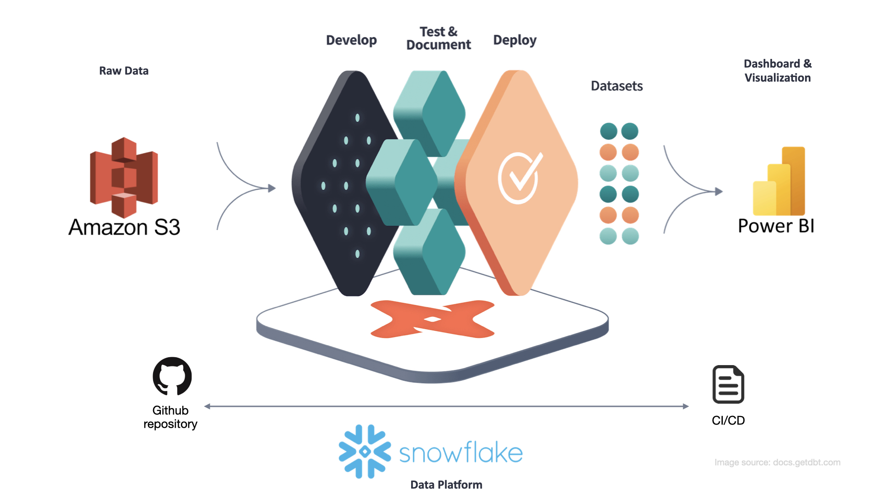

# Netflix Movie Analytics — A Modern Data Stack Project

## 1. Overview  
This project demonstrates a complete **analytics engineering pipeline** that transforms raw **MovieLens** data from **Amazon S3**, processes it in **Snowflake** using **dbt**, and visualizes insights in **Power BI**.  

The pipeline is designed to be:  
- **Automated** – minimal manual intervention once configured.  
- **Scalable** – capable of handling increasing data volumes.  
- **Version-controlled** – transformations managed in code for transparency and collaboration.  

---


## 2. Problem Statement / Business Objective
The goal of this project is to analyze **user ratings**, **tagging activity**, and **movie metadata** to:

- Understand **audience engagement patterns**
- Assess **content performance** by genre and tags
Generate **recommendations** for movies based on popularity and ratings
This project shows how analytics engineering practices can convert raw event data into actionable business insights.

## 3. Key Metrics / Analytics Insights
The three data marts created in this project address different business problems:

- **Audience Analysis** (fct_user_behaviour_genres & fct_user_behaviour_genres_concat)

    -- **Metrics**: user engagement level, total ratings, average rating per user.

    -- **Insights**: Identify highly engaged users and their preferred genres, useful for marketing segmentation and targeted recommendations.

- **Content Analysis** (dim_movie_tag_profile & fct_tag_performance)

    --**Metrics**: weighted average rating per tag, number of movies per tag, top tags per movie.

    -- **Insights**: Understand which tags or genres correlate with high ratings, useful for content acquisition and promotional strategy.

-- **Recommendation** (fct_movie_recommendation)

    -- **Metrics**: average movie ratings, rating count, recommendation categories.

    -- **Insights*: Recommend top-performing movies to users based on aggregated metrics, useful for personalization engines and improving user satisfaction.


## 4. Data Lineage 
The DBT DAG below illustrates the full data flow, from raw source tables to final business-ready marts. This directed acyclic graph makes **dependencies and data lineage explicit**, ensuring transparency and supporting a single source of truth.


## 5.Project Structure Overview

This project is  structured to follow DBT best practices. By stacking transformations in **modular, optimized layers**, we move from narrow source models to **business-conformed designs**, applying each transformation in only one place. A disciplined folder and file layout helps create clear, maintainable stories through both our data and codebase.

- **Staging**: Maps raw source tables with minimal transformations.  
- **Intermediate**: Handles joins, aggregations, and reusable logic.  
- **Marts**: Business-ready fact and dimension tables for reporting.  
- **Domains**: Organized by business area (audience, content, recommendation).  
- **Macros & Seeds**: Reusable SQL logic and static reference data. 
```
dbt_netflix
├── README.md
├── analyses
│   ├── audience
│   │   ├── audience_analysis.yml
│   │   ├── top_5_genres_high_engagement.sql
│   │   └── top_5_grouped_genres_high_engagement.sql
│   └── recommendation
│       ├── recommendation_analysis.yml
│       └── top_5_movies_by_category.sql
├── seeds
│   └── recommendation_categories.csv
├── dbt_project.yml
├── macros
│   ├── relevance_range.sql
│   ├── top_n_qualify.sql
│   └── weighted_avg.sql
├── models
│   ├── intermediate
│   │   ├── audience
│   │   │   ├── _int_audience__models.yml
│   │   │   ├── int_movie_details.sql
│   │   │   ├── int_movie_genres_concat.sql
│   │   │   ├── int_movie_genres.sql
│   │   │   ├── int_user_daily_rating.sql
│   │   │   └── int_user_profiles.sql
│   │   ├── content
│   │   │   ├── _int_tags__models.yml
│   │   │   ├── int_movie_rating_tag_stats.sql
│   │   │   ├── int_movie_tag_relevance.sql
│   │   │   ├── int_movie_top_tags.sql
│   │   │   └── int_tag_movie_link.sql
│   │   └── recommendation
│   │       ├── _int_recommendation__models.yml
│   │       └── int_movie_recommendation.sql
│   ├── marts
│   │   ├── audience
│   │   │   ├── _audience__models.yml
│   │   │   ├── fct_user_behaviour_genres_concat.sql
│   │   │   └── fct_user_behaviour_genres.sql
│   │   ├── content
│   │   │   ├── _content__models.yml
│   │   │   ├── dim_movie_tag_profile.sql
│   │   │   └── fct_tag_performance.sql
│   │   └── recommendation
│   │       ├── _recommendation__models.yml
│   │       └── fct_movie_recommendations.sql
│   └── staging
│       ├── source.yml
│       ├── src_genome_sources.sql
│       ├── src_genome_tags.sql
│       ├── src_links.sql
│       ├── src_movies.sql
│       ├── src_ratings.sql
│       └── src_tags.sql
├── packages.yml
├── snapshots
│   ├── movie_recommendations_snapshot.yml
│   └── movie_recommendations_snapshot.sql
└── tests
    └── test_movie_recommendation_logic.sql

```
## 3. Architecture & Data Flow  

### Data Pipeline Diagram   


### Flow Description  
1. **Extract & Load**  
   - Raw `.csv` files are stored in an **Amazon S3 bucket**.  
   - Data is ingested into **Snowflake staging** via an **external stage**, keeping storage and compute separate.  

2. **Transform**  
   - **dbt** (data build tool) performs transformations directly in Snowflake.  
   - Raw data is cleaned, modeled, and aggregated into **business-ready tables**.  
   - Transformation logic is managed as **SQL code with version control**, ensuring data lineage and reusability.  

3. **Consume & Visualize**  
   - Final dbt models are materialized in **Snowflake’s data mart layer**.  
   - **Power BI** connects directly to this curated layer, ensuring a **single source of truth** for reporting and analytics.  

**Pipeline Summary:**  
`Amazon S3 → Snowflake (Staging) → dbt → Snowflake (Marts) → Power BI`

---

## 3. Technical Stack  

- **Cloud Storage**: Amazon S3  
- **Data Warehouse**: Snowflake  
- **Transformation**: dbt Core  
- **Business Intelligence**: Power BI  

---


# DBT Netflix Project Structure
